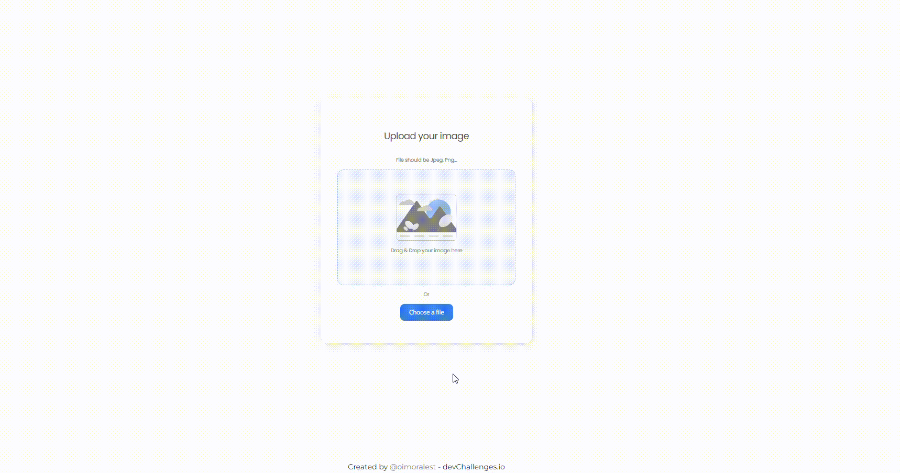

<h1 align="center">Image uploader 📂</h1>

<div align="center">
   Solution for a challenge from  <a href="http://devchallenges.io" target="_blank">Devchallenges.io</a>.
</div>

<div align="center">
  <h3>
    <a href="/">
      Demo
    </a>
    <span> | </span>
    <a href="/">
      Solution
    </a>
    <span> | </span>
    <a href="https://devchallenges.io/challenges/O2iGT9yBd6xZBrOcVirx">
      Challenge
    </a>
  </h3>
</div>


<!-- OVERVIEW -->

## Overview



Image uploader is a project presented as a solution to the challenge [image uploader](https://devchallenges.io/challenges/O2iGT9yBd6xZBrOcVirx)

### Built With

- [React](https://reactjs.org/)

## How To Use

To clone and run this application, you'll need [Git](https://git-scm.com) and [Node.js](https://nodejs.org/en/download/) (which comes with [npm](http://npmjs.com)) installed on your computer. From your command line:

```bash
# Clone this repository
$ git clone https://github.com/oimoralest/image_uploader.git

# install the dependencies
$ npm install

# run the app
$ npm run dev
```

## Contact

- LinkedIn [/in/oimoralest](https://www.linkedin.com/in/oimoralest/)
- GitHub [@oimoralest](https://github.com/oimoralest)
